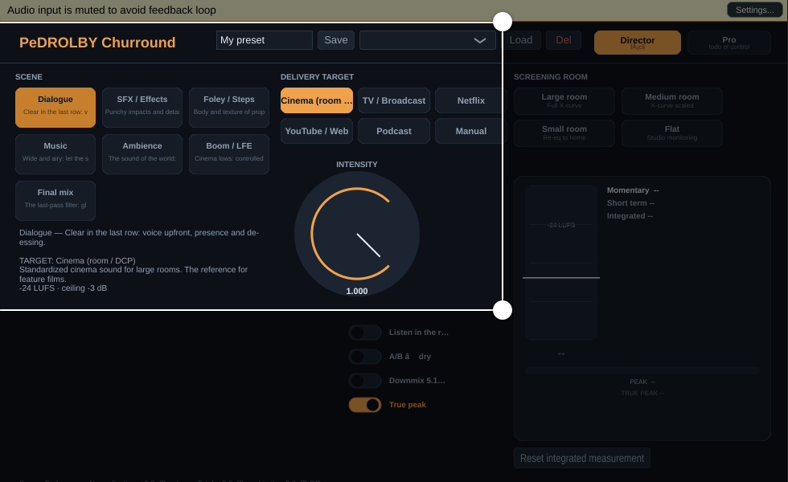
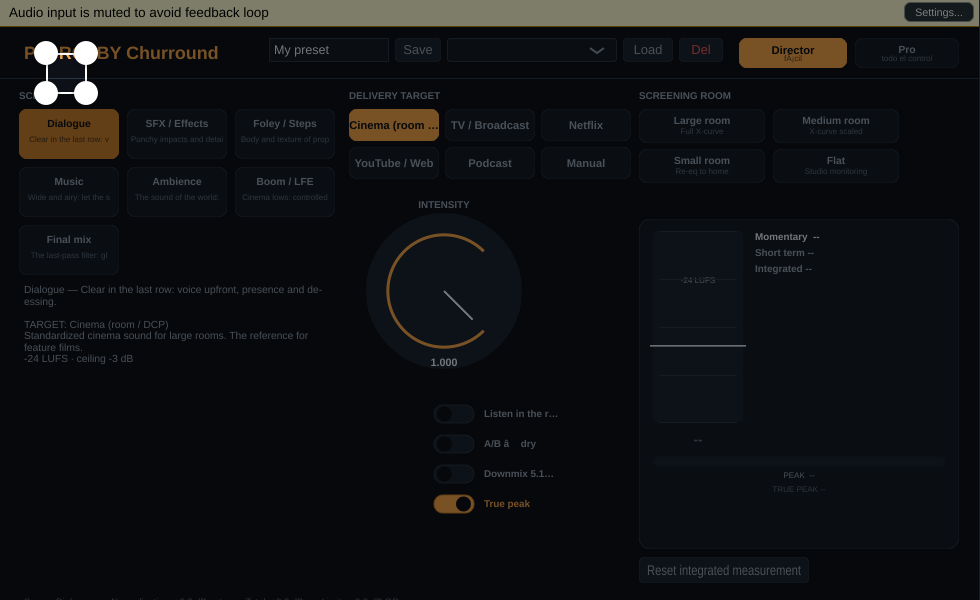

# PeDROLBY Churround — audio de cine en REAPER (VST3 / AU)

> **El plugin todo-en-uno que convierte el audio de tu película en "audio de
> cine" — con un botón.** Producción y postproducción de audio para video y
> películas, con **surround 5.1/7.1**. Multiplataforma: **Windows · macOS ·
> Linux**. Funciona en REAPER y cualquier DAW con VST3/AU.


*Vista Director — para directoras/es, editoras/es y dirección artística.*


*Vista Pro — control total para quienes mezclan.*

---

## Qué es

PeDROLBY Churround reúne en un solo plugin lo que normalmente exige una
cadena de varios: **EQ Cinema (curva X ISO 2969)** para salas grandes,
**normalización de sonoridad por estándar de entrega**, **módulos por
escena**, **simulador de sala (pre-escucha)**, **A/B**, **downmix 5.1→2.0**,
**true-peak**, **bass management (graves/LFE)** y **presets de usuario**, con
dos caras:

| | **Director** (fácil) | **Pro** (full) |
|---|---|---|
| Para quién | dirección, edición, dirección artística | mezcla y mastering |
| Qué ves | Escena → Destino → Intensidad, pre-escucha | Todos los controles + medidores |
| Jerga | Cero | dB, LUFS, threshold, techo, crossover… |

---

## Manual de uso

### 1. Instalación

| SO | Carpeta del plugin |
|---|---|
| **Windows** | `C:\Program Files\Common Files\VST3\` |
| **macOS** | `~/Library/Audio/Plug-Ins/VST3` (y `Components` para AU) |
| **Linux** | `~/.vst3/` |

1. Compila (abajo) o descarga los artefactos.
2. Copia el bundle `PeDROLBY Surround.vst3` a la carpeta de tu SO.
3. En REAPER: *Options → Preferences → Plug-ins → VST* (añade la carpeta si
   falta) y **Re-scan** (o reinicia REAPER).
4. Busca **"PeDROLBY"** en el menú FX e insértalo en un track.

> También puedes usar el **Standalone** (binario independiente, sin DAW) para
> probar el sonido y la UI al vuelo.

### 2. Primeros pasos (60 segundos)

1. Inserta el plugin en el track.
2. **Escena**: pulsa lo que estás tratando (Diálogo, SFX, Foley, Música,
   Ambiente, Boom/LFE, Mix final).
3. **Destino de entrega**: pulsa dónde se escuchará (Cine, TV, Netflix,
   YouTube/Web, Podcast o Manual).
4. **Intensidad**: cuánto efecto artístico (de sutil a mucho cine).
5. Listo: el plugin ecualiza, normaliza y limita según tu elección. El
   medidor te dice en palabras si el nivel está bien.

### 3. Vista Director (detalle)

- **SCENE** — presets creativos que configuran toda la cadena según el
  contenido:
  - *Dialogue*: voz clara al frente (presencia + de-esser), "que se entienda
    en la última fila".
  - *SFX / Foley / Music / Ambience / Boom-LFE / Final mix*: cada uno con sus
    ajustes (HP, cuerpo, presencia, aire, compresión, anchura).
- **DELIVERY TARGET** — el "número legal" de cada destino:
  - *Cinema* −24 LUFS / techo −3 dB · *TV* −23 · *Netflix* −27 · *Web* −14 ·
    *Podcast* −16 · *Manual* (target propio en Pro).
- **SCREENING ROOM** — tamaño de sala para la **curva X** (compensación de
  la sala): grande/IMAX → curva completa; mediana/pequeña → suavizada;
  *Flat* = monitorización neutra.
- **INTENSITY** — un solo knob que escala todo el tratamiento creativo
  (la normalización y el limitador no se tocan: son la "regla", no arte).
- **Listen in the room** — pre-escucha cómo sonará la mezcla *dentro* de la
  sala destino (absorción de agudos + acumulación de graves). Monitoreo
  puro: al apagarlo vuelve el procesado normal.
- **A/B — dry** — compara al instante procesado ↔ original.
- **Downmix 5.1→2.0** — pliega surround a estéreo (ver Pro).
- **True peak** — activa/desactiva el limitador a pico verdadero.
- Medidor (derecha): **momentáneo / corto / integrado LUFS**, pico de
  muestra, **TRUE PEAK** (dBTP) y la etiqueta humana (SOUNDS GOOD / TOO
  LOUD…). Pulsa *Reset integrated measurement* para reiniciar la medida.

### 4. Vista Pro (detalle)

**Cinema EQ — X-curve (ISO 2969)**
- *Room*: escala completa de la curva (0 = plano, 1 = sala grande).
- *Lows / Lows Hz*: shelf de graves (valor típico −4 dB @ 100 Hz: graves
  secos y sólidos de cine).
- *2k / 4k / 8k*: la subida de ~+3 dB/octava por encima de 2 kHz.
- *Air / Air Hz*: shelf de aire a ~10 kHz.
- Botones *Large/Medium/Small/Flat*: presets rápidos de sala.

**Scene**
- *HP Hz*: high-pass del contenido (diálogo ~100 Hz, boom ~22 Hz).
- *Body F/G*: cuerpo en medios graves. *Pres F/G*: presencia (inteligibilidad).
- *Air G*: aire a 12 kHz. *De-ess*: reduce sibilantes automáticamente.
- *Comp*: compresión glue. *Width*: anchura mid/side (**solo estéreo**).
- Botones de escena = punto de partida (aplican los valores del preset).

**Delivery · Monitoring · Surround**
- *Normalize* + *Target LUFS* (Manual) + *Manual gain* + lectura de ganancia
  automática.
- *Limiter* + *Ceiling dBFS* + reducción actual del limitador.
- *Listen in the room*, *A/B — dry*.
- *Rears dB* / *LFE dB*: ganancia de mastering por canal (antes del
  limitador). La medición LUFS usa pesos ITU (LFE excluido, surrounds 1.41).

**Bass management** (surround con canal LFE)
- *Bass mgmt*: activa el enrutado de graves.
- *Xover Hz*: frecuencia del crossover Linkwitz-Riley 4º orden (40–300 Hz).
- *LFE +dB*: ganancia extra del LFE.
- *Send to LFE*: suma los graves de todos los canales principales al LFE.
- *HP mains*: quita el bajo de los canales principales (todo el graves sale
  por el subwoofer). En estéreo/mono el módulo se desactiva solo.

**Downmix 5.1→2.0 y True peak**
- *Downmix*: L' = L + 0.707·C + 0.707·Ls (+ LFE −6 dB); se aplica **antes**
  del limitador para que la suma plegada quede protegida; los canales
  envolventes se silencian (print estéreo).
- *True peak*: el limitador analiza el pico reconstruido (oversampling 4×,
  BS.1770/EBU R128) y lo mantiene bajo el techo — lo que de verdad ven
  codecs y conversores.

### 5. Presets de usuario

La barra de la cabecera (independiente de los presets del DAW):
1. Escribe un nombre en el campo de texto.
2. **Save** guarda toda la configuración actual.
3. En el desplegable, elige uno y pulsa **Load** (restaura todos los
   parámetros); **Del** lo borra.
Los presets viajan con el estado del plugin (se guardan en el proyecto y en
el snapshot del DAW).

### 6. Consejos rápidos

| Problema | Solución |
|---|---|
| "El diálogo no se entiende en la sala" | Escena *Dialogue* + sala *Large* + Intensidad alta |
| "En el cine se oye apagado" | Escucha con *Listen in the room* y sube *8k/Air* hasta compensar |
| "Mi video de YouTube es bajito" | Destino *Web* (−14 LUFS, techo −1 dBTP) |
| "Necesito entregar a Netflix" | Destino *Netflix* (−27 LKFS) |
| "Quiero subwoofer en el cine" | Pro → *Bass mgmt* + *HP mains* + *Send to LFE* (solo surround) |
| "Tengo 5.1 y debo entregar estéreo" | *Downmix 5.1→2.0* y enruta L/R del track a la salida |

### 7. Notas técnicas

- **Latencia: 0** muestras (el true-peak usa oversampling solo para
  análisis, sin desviar la señal).
- La **medición LUFS siempre es sobre la entrada**, antes de procesar, para
  que la normalización apunte al material real.
- Ventanas de medición: momentáneo 400 ms, corto ~3 s, integrado con gating
  (absoluto −70 / relativo −10 LUFS) desde el último reset.
- Surround: pesos ITU BS.1770-4 por canal; anchura mid/side desactivada en
  multicanal; límite de 8 canales (discretos aceptados).

---

## Build

```bash
cmake -S . -B build -DCMAKE_BUILD_TYPE=Release
cmake --build build --target CineLab_VST3 -j
cp -r "build/install/VST3/PeDROLBY Surround.vst3" ~/.vst3/   # Linux
```

- macOS (universal): `-DCMAKE_OSX_ARCHITECTURES="arm64;x86_64"` + targets
  `CineLab_VST3 CineLab_AU`.
- Windows: `cmake --build build-win --target CineLab_VST3 --config Release`.
- **GitHub Actions** (`.github/workflows/build.yml`) compila los tres SO y
  sube artefactos: macos-latest (VST3+AU universal), ubuntu-latest,
  windows-latest.
- Dependencias por SO y solución de problemas: **docs/BUILD.md**.

## Tests

```bash
cmake -S . -B build -DCINELAB_BUILD_TESTS=ON
cmake --build build --target CineLabDSPTest CineLabLayoutTest -j
./build/CineLabDSPTest      # 9 secciones: curva X, limitador, LUFS,
                            # normalizador, escena, simulador, downmix,
                            # true-peak, bass management
DISPLAY=:1 ./build/CineLabLayoutTest   # solapamientos de UI + 5.1 + presets
```

## Estructura

```
Source/dsp/      Biquad, KWeighting, LoudnessMeter, CinemaEQ, RoomSimulator,
                 SceneModule, LoudnessNormalizer, SimpleLimiter, Downmixer,
                 BassManager, DeliveryStandards
Source/ui/       Tema, knobs con "?", medidores, vistas Director/Pro,
                 PresetBar (presets de usuario)
Source/          PluginProcessor (cadena + APVTS), PluginEditor, Parameters,
                 Presets, UserPresets
tools/           Tests de DSP y de layout (+ renders PNG)
docs/            Diseño, build, guía REAPER, capturas
.github/workflows/build.yml   CI (Linux/macOS/Windows)
juce/            JUCE 9.0.1 (submódulo)
```

## Licencia

**AGPLv3** (requisito del framework JUCE, que se usa bajo su licencia open
source). Ver `LICENSE`. Para distribución comercial cerrada, contacta para
una licencia comercial de JUCE.

## Roadmap

- **v0.1–v0.3 (hecho)**: curva X, normalización por estándar, escenas,
  medidores, simulador de sala, A/B, surround 5.1/7.1, downmix, true-peak,
  bass management, presets de usuario, CI multiplataforma.
- **v0.4**: gestión de alturas (básico Atmos-upmix), detección automática de
  escena (IA ligera), presets con carpetas.